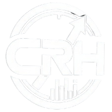

  
  
   
   

  <h3>🚀 Sobre mí 🚀</h3>
  
  

    🎓 <strong>Estudiante de Ingeniería</strong> que disfruta encontrando soluciones simples a problemas difíciles. 
    💻 <strong>Me encanta el Desarrollo Web</strong> y crear proyectos que sean útiles y se vean bien. 
    🔍 <strong>Curioso por naturaleza</strong>: siempre estoy investigando cómo funcionan las cosas por dentro. 
    ⚡ Me gusta <strong>convertir ideas en código real</strong> y nunca paro de aprender algo nuevo.
  

   
   

  <h3>🛠️ Tecnologías 🛠️</h3>
   
  
  

    
  

   
   

  <h3>📈 Estadísticas 📈</h3>
   
  
  

    <!-- Lenguajes más usados (Gráfico de Torta) -->
    
  

   
   
  
  <h3>👤 ¿Donde encontrarme? 👤</h3>
   

  

    
    
    
    
    
  

  <h3>💻 Proyectos 💻</h3>
   
  
Clickea en el logo para ver mas sobre el proyecto o en el nombre para ver el repositorio

  

    <table>
      <tr>
        <td width="50%" align="center" valign="top">
          
           
          <a href="https://github.com/YoshiHD4K/CRH" target="_blank"><h3 align="center">Control y Registro de Horas</h3></a>
          

            
          

        </td>
        <td width="50%" align="center" valign="top">
          
           
          <a href="https://github.com/YoshiHD4K/15Arianna" target="_blank"><h3 align="center">Invitaciones 15 Años</h3></a>
          

            
          

        </td>
      </tr>
      <tr>
        <td width="50%" align="center" valign="top">
          
           
          <a href="https://github.com/YoshiHD4K/galaxia-romantica" target="_blank"><h3 align="center">Sistema Solar</h3></a>
          

            
          

        </td>
        <td width="50%" align="center" valign="top">
          
           
          <a href="https://github.com/Marivigg04/aguacatechat" target="_blank"><h3 align="center">AguacateChat</h3></a>
          

            
          

        </td>
      </tr>
    </table>
  

